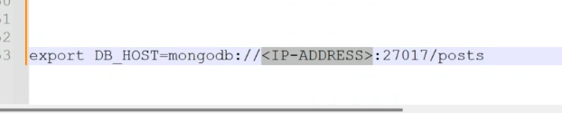

````markdown
# Install MongoDB Community Edition

Follow these steps to install MongoDB Community Edition using the **apt package manager**:

---

## 1. Import the Public Key

- Install `gnupg` and `curl` if they are not already available:
  ```bash
  sudo apt-get install gnupg curl
  ```
````

- Import the MongoDB public GPG key by running:
  ```bash
  curl -fsSL https://www.mongodb.org/static/pgp/server-8.0.asc | \
  sudo gpg -o /usr/share/keyrings/mongodb-server-8.0.gpg \
  --dearmor
  ```

---

## 2. Create the List File

- Create the list file `/etc/apt/sources.list.d/mongodb-org-8.0.list` for your version of Ubuntu.

For **Ubuntu 22.04 (Jammy)**:

```bash
echo "deb [ arch=amd64,arm64 signed-by=/usr/share/keyrings/mongodb-server-8.0.gpg ] https://repo.mongodb.org/apt/ubuntu jammy/mongodb-org/8.0 multiverse" | sudo tee /etc/apt/sources.list.d/mongodb-org-8.0.list
```

---

## 3. Reload the Package Database

- Reload the local package database by running:
  ```bash
  sudo apt-get update
  ```

---

## 4. Install MongoDB Community Server

- Install the **latest stable version** of MongoDB by running:
  ```bash
  sudo apt-get install -y mongodb-org
  ```
- Install the **specific version** of MongoDB by running:

```bash
sudo apt-get install -y mongodb-org=7.0.6 mongodb-org-database=7.0.6 mongodb-org-server=7.0.6 mongodb-mongosh mongodb-org-mongos=7.0.6 mongodb-org-tools=7.0.6
```

```

```

```

```

````markdown
# Instructions to Set Up and Run the Application with MongoDB

## Start MongoDB

1. Start the MongoDB service:
   ```bash
   sudo systemctl start mongod
   ```
````

2. Check if MongoDB is running:
   ```bash
   sudo systemctl status mongod
   ```
   - You should see that it is active and running.

## Configure the Bind IP

1. Open the MongoDB configuration file:
   ```bash
   sudo vim /etc/mongod.conf
   ```
2. Modify the `bindIp` to allow external connections by setting it to:
   ```
   bindIp: 0.0.0.0
   ```
3. Restart MongoDB to apply the changes:

   ```bash
   sudo systemctl restart mongod
   ```

4. Enable MongoDB to start on boot:
   ```bash
   sudo systemctl enable mongod
   ```

---

## Set Up the Application on the App VM

1. Navigate to the application's source code directory:
   ```bash
   cd <path-to-source-code>
   ```
2. Install the dependencies:

   ```bash
   npm install
   ```

3. Set up the environment variable to establish communication between the app and the database VM:

   - Export the MongoDB connection string (replace `<PRIVATE_IP>` with the private IP address of the database VM):
     ```bash
     export DB_HOST=mongodb://<PRIVATE_IP>/posts
     ```

4. Start the application:

   ```bash

   npm install && npm start
   ```

5. Access the application in your browser:
   ```
   http://<public-ip>:3000/posts
   ```

---



```

```
